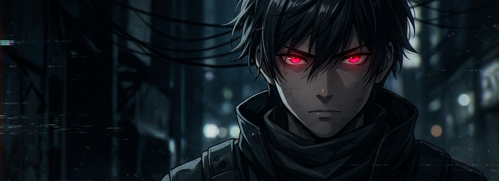

  

## About me

I'm a **Software Engineer** and **Founder of [Renbo Studios](https://renbostudios.com)** — building production SaaS, mobile applications, and developer infrastructure.

Currently studying Software Engineering at Miva University, Abuja 🇳🇬

- 🔭 Building AI agent platforms, edge OTA infra, and messaging APIs
- ⚡ Focused on clean architecture, fast shipping, and developer ergonomics

 

---

## What I've built

**Open Source**
- [Velox](https://github.com/itskodaaa/Velox) — Whisper-powered macOS dictation app
- [Edge OTA](https://github.com/renbostudios/edge-ota) — Serverless Expo OTA update engine · [npm](https://www.npmjs.com/package/@renbostudios/edge-ota) · [ota.renbo.site](https://ota.renbo.site)
- [GhostWriter](https://github.com/itskodaaa/GhostWriter) — Automated video clipping engine
- [LeadMachine](https://github.com/itskodaaa/LeadMachine) — Autonomous B2B outreach engine

**Production Software**
- [Vozia](https://vozia.renbostudios.com) — Conversational AI agent platform · [Play Store](https://play.google.com/store/apps/details?id=com.renbostudios.vozia)
- [CityPal](https://citypal.app) — Hyper-local community social network · [App Store](https://apps.apple.com/us/app/citypal/id6759269853) · [Play Store](https://play.google.com/store/apps/details?id=com.renbostudios.citypalapp)
- [Abdella Health](https://abdella.app) — Clinical healthcare learning platform
- [Conduit](https://conduit.renbo.site) — Unified multi-channel messaging API
- [Nurio](https://nurio.sh) — Autonomous AI SEO engine
- [Renbo Studios](https://renbostudios.com) — Digital product software studio
- [Kodafolio](https://koda.renbostudios.com) — Personal developer portfolio website

**More projects** — PitchCue · Smart Attendance System · GadgetVault · AroundMe · Orbit · CareerM8 Bot

---

## My daily drivers

  

## Tech Stack

  
  
  
  
  
  
  
  
  
  
  
  
  

## Languages & tools I use

  

---

## Analytics

  

  
  

---

